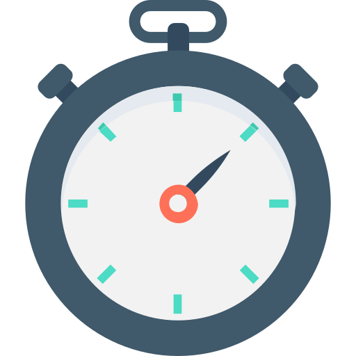
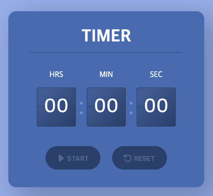
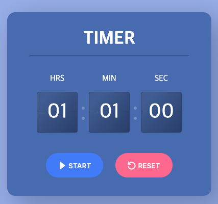
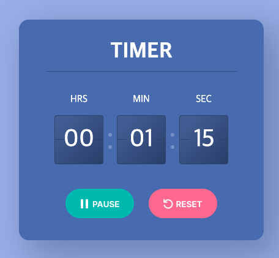

  

<h2 align="middle">타이머</h2>
<h3 align="middle">HTML / CSS / JavaScript 활용 연습 Part03</h3>

DEMO : https://d-charlie-kim.github.io/Timer/

  
  
  

## 🔥 Projects!

  
  
  

## 🎯 기능 요구사항

디지털 타이머를 구현한다.

- [x] 시, 분, 초 단위로 숫자를 입력받는다.
- [x] 초는 10초 단위로 입력받는다.
- [x] 0초가 되면 reset 된다.
- [x] 0초가 되면 alert로 종료됨을 표시한다.
- [x] start 와 pasue로 타이머를 시작하고 멈출 수 있다.
- [x] 숫자가 입력되지 않으면 타이머 버튼은 활성화되지 않는다.

## 💟 기능 구현 목록

### ▶️ 기본 기능

- [x] 시, 분, 초 섹션을 클릭하면 시간이 증가한다.
- [x] 60초가 되면 0초로 바뀌며 분 이 증가한다.
- [x] 60분이 되면 0초로 바뀌며 시 가 증가한다.
- [x] 99시간을 최대값으로 설정해서, 그 이상은 증가하지 않는다.
- [x] 시간이 입력되면 버튼이 활성화된다.
- [x] Reset버튼을 누르면 초기화된다.
- [x] 타이머가 시작되면 Start버튼은 Pause버튼으로 전환된다.
- [x] Pause버튼을 누르면 일시정지되고, Start버튼으로 다시 전환된다.
- [x] 0초가 되면 종료 알림을 알려준다.
- [x] 0초가 되면 타이머가 리셋된다.
